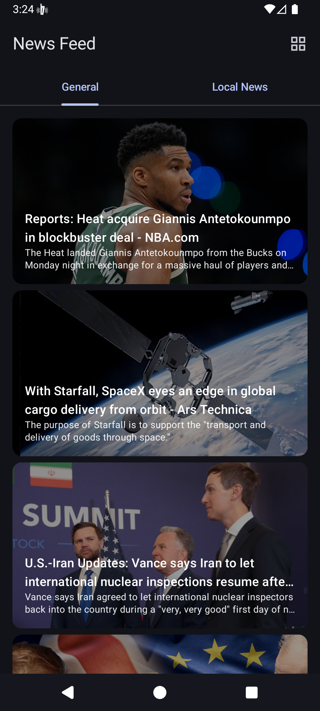
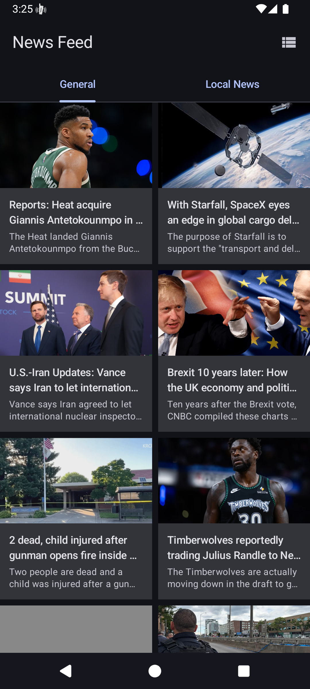
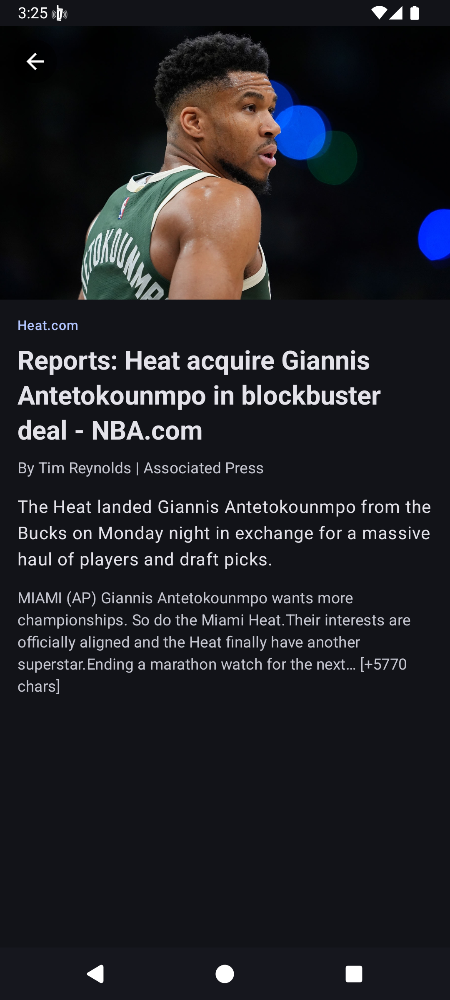

# News Feed Android App

A simple Android application that displays news articles using the NewsAPI. Built with Clean Architecture principles, following the [Now in Android](https://github.com/android/nowinandroid) reference architecture.

## Features

| List View                       | Grid View                       | Detail View                       |
|---------------------------------|---------------------------------|-----------------------------------|
|  |  |  |


- 📰 Browse top news headlines
- 🔄 List/Grid view toggle
- 📱 Modern Material Design 3 UI
- ♾️ Infinite scrolling with pagination
- 🗄️ **Offline Caching**: Read downloaded news without an internet connection (Room).
- 📍 **Localized News (LBS)**: Dynamically fetches news for your current country using GPS.
- 🔒 **Mobile Security**: Protected against rooting, emulators, tampering, and MITM attacks via freeRASP and Network Security Config.
- 📳 **Shake to Refresh**: Physically shake the device to reload the feed using the Accelerometer sensor.
- 🖼️ Image loading with caching
- ⚡ Fast and responsive

## Documentation

1. [Database & Caching Setup](docs/1_Database_Setup.md)
2. [GPS & Location Based Services (LBS)](docs/2_GPS_LBS_Feature.md)
3. [Wireframes & UI Mockups](docs/3_Wireframe_UI_Mockup.md)
4. [Mobile Security Features](docs/4_Mobile_Security.md)
5. [Hardware Sensors Integration](docs/5_Mobile_Sensor.md)
6. [Cellular Network & API Optimization](docs/6_Cellular_Network.md)

## Architecture

This project follows **Clean Architecture** with **MVVM** pattern, organized into modular layers:

```
app/
├── core/
│   ├── data/          # Repository implementations, data sources
│   ├── database/      # Room DB, DAOs, Entities
│   ├── domain/        # Use cases, business logic
│   ├── model/         # Domain models
│   ├── network/       # API service, DTOs
│   ├── ui/            # Shared UI components
│   └── designsystem/  # Theme, colors, typography
└── feature/
    ├── home/          # News list screen
    └── detail/        # Article detail screen
```

### Module Dependency Graph

```
app
 ├─> feature:home
 │    ├─> core:domain
 │    │    ├─> core:data
 │    │    │    ├─> core:database
 │    │    │    ├─> core:network
 │    │    │    └─> core:model
 │    │    └─> core:model
 │    └─> core:ui
 └─> feature:detail
      ├─> core:model
      └─> core:ui
```

## Tech Stack

### Core
- **Kotlin** - Programming language
- **Coroutines & Flow** - Asynchronous programming
- **Jetpack Compose** - Modern declarative UI
- **Material 3** - Design system

### Architecture Components
- **ViewModel** - UI state management
- **Paging 3** - Infinite scrolling pagination (with `RemoteMediator`)
- **Navigation Compose** - Screen navigation

### Security & Device
- **Talsec freeRASP** - Runtime Application Self-Protection (Root, Emulator, Hooking detection)
- **Play Services Location** - GPS coordinates and Reverse Geocoding
- **Hardware Sensors** - Accelerometer event detection

### Dependency Injection
- **Koin** - Lightweight DI framework

### Networking & Data
- **Retrofit** - REST API client
- **Moshi** - JSON serialization
- **OkHttp** - HTTP client with interceptors
- **Chucker** - On-device network inspector
- **Room** - Local SQLite caching (SSOT pattern)

### Image Loading
- **Coil** - Image loading and caching

### Testing
- **JUnit 4** - Testing framework
- **Mockito & Mockito-Kotlin** - Mocking framework
- **Coroutines Test** - Testing coroutines
- **Arch Core Testing** - Testing LiveData/ViewModel

## Setup

### Prerequisites
- Android Studio Hedgehog or later
- JDK 17
- NewsAPI key (get it from [newsapi.org](https://newsapi.org))

### Configuration

1. Clone the repository
2. Add your NewsAPI key to `local.properties`:
```properties
API_KEY=your_api_key_here
```
3. Build and run
