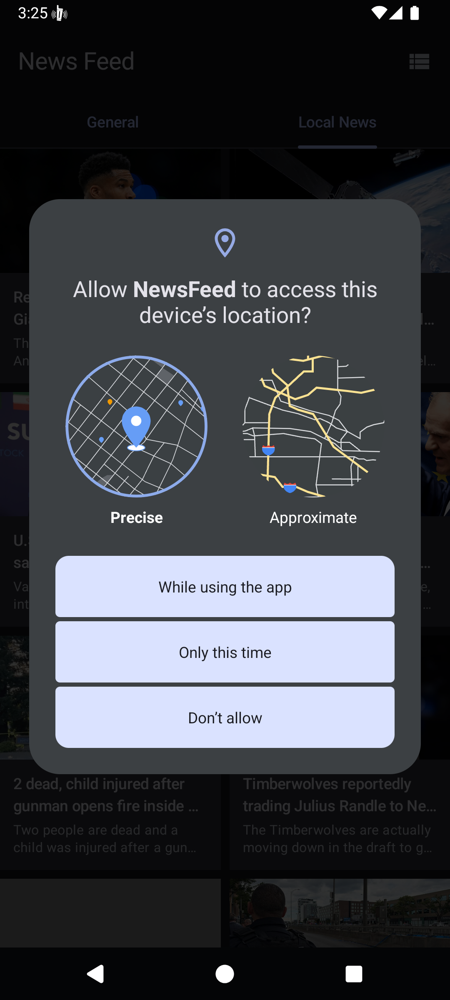
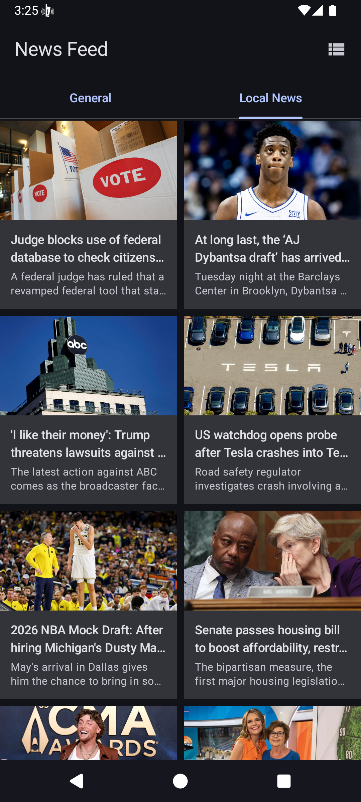

# GPS & LBS (Location Based Services) Feature

This project implements mobile location sensors to deliver localized news content based on the user's current physical location.

## 1. Feature Description
The application accesses the device's location when the user navigates to the "Local News" tab. It retrieves the current country code and adjusts the news feed accordingly.

## 2. Technical Implementation

- **Library**: `FusedLocationProviderClient` from Google Play Services.
- **Permissions Required**: 
  - `ACCESS_COARSE_LOCATION`
  - `ACCESS_FINE_LOCATION`
- **Component**: `LocationTracker`

### Code Sample
Here is the core logic inside the project responsible for fetching and reverse-geocoding the user's location into a specific Country Code:

```kotlin
override suspend fun getCurrentLocation(): Location? {
    // Check Permissions
    val hasAccessFineLocationPermission = ContextCompat.checkSelfPermission(
        application, Manifest.permission.ACCESS_FINE_LOCATION
    ) == PackageManager.PERMISSION_GRANTED
    
    if (!hasAccessFineLocationPermission) return null

    // Fetch Coordinates and Geocode to Country Code
    return suspendCancellableCoroutine { cont ->
        locationClient.lastLocation.addOnCompleteListener { task ->
            if (task.isSuccessful && task.result != null) {
                val address = geocoder.getFromLocation(
                    task.result.latitude, 
                    task.result.longitude, 
                    1
                )?.firstOrNull()
                
                val countryCode = address?.countryCode?.lowercase() ?: "us"
                cont.resume(Location(countryCode))
            } else {
                cont.resume(null)
            }
        }
    }
}
```

### Workflow:
1. **Permission Check**: The application verifies if location permissions have been granted via a Compose dialog.
2. **Coordinate Retrieval**: `LocationTracker` retrieves the device's current Latitude and Longitude.
3. **Reverse Geocoding**: The coordinates are processed using Android's native `Geocoder` to obtain the physical address.
4. **Country Code Extraction**: The "Country Code" is extracted from the address object (e.g., `ID` for Indonesia or `US` for the United States).
5. **Content Fetching**: The country code is passed as a parameter (`country=id`) to the NewsAPI endpoint to localize the news feed.

## 3. Implementation Screenshots

| Permission Request Dialog          | Localized News Feed                  |
|------------------------------------|--------------------------------------|
|  |  |
