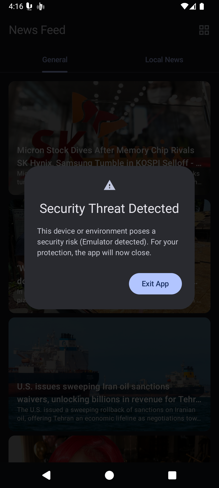

# Mobile Security Features

This project incorporates security measures mapped against the **OWASP Mobile Top 10**.

## OWASP Mobile Top 10 Mitigation Matrix

### M1: Improper Credential Usage
**Mitigation:** The application does not authenticate users. The only credential is the `NewsAPI` key, which is safely injected at build-time via `local.properties` and never hardcoded in the repository.

### M2: Inadequate Supply Chain Security
**Mitigation:** The freeRASP SDK restricts execution to authorized app stores like Google Play. This prevents the application from running if installed via side-loading or untrusted third-party marketplaces.

### M3: Insecure Authentication/Authorization
**Mitigation:** Not applicable. The application functions entirely as a read-only news feed and does not handle user accounts or privileged actions.

### M4: Insufficient Input/Output Validation
**Mitigation:** All incoming API responses are strictly parsed and validated using **Moshi** and **Retrofit**. Kotlin's strict nullability further prevents injection or malformed data crashes.

### M5: Insecure Communication
**Mitigation:** The OS-level `network_security_config.xml` explicitly disables cleartext HTTP traffic. All network requests are strictly routed over encrypted HTTPS (SSL/TLS) to prevent MITM attacks.

### M6: Inadequate Privacy Controls
**Mitigation:** Location permissions are requested only when navigating to the Local News tab. GPS coordinates are used exclusively for local reverse geocoding and are never transmitted to backend servers.

### M7: Insufficient Binary Protection
**Mitigation:** **freeRASP by Talsec** actively prevents execution on rooted/jailbroken devices, blocks emulators, and detects memory hooking (e.g., Frida). App tampering is prevented via public signature hashing. Release builds are obfuscated via **ProGuard/R8**.

### M8: Security Misconfiguration
**Mitigation:** Debugging tools, such as the Chucker network inspector, are strictly isolated to `debug` builds and completely stripped from the production release.

### M9: Insecure Data Storage
**Mitigation:** Local Room caching is used exclusively for public news articles. Sensitive API keys are never stored locally in the database or shared preferences.

### M10: Insufficient Cryptography
**Mitigation:** The app relies entirely on modern Android native TLS implementations for network transport. No custom or deprecated cryptographic algorithms are used in the codebase.

---

## Code Sample: RASP Security Monitor

```kotlin
object SecurityMonitor : ThreatListener.ThreatDetected {
    private val _threatFlow = MutableStateFlow<String?>(null)
    val threatFlow: StateFlow<String?> = _threatFlow.asStateFlow()

    fun initialize(context: Context) {
        val expectedPackageName = "id.idham.newsfeed"
        val expectedAlternativePackageNames = arrayOf("com.android.vending")
        val expectedSigningCertificateHashBase64 = arrayOf("U4FUXOMbsknBix9IY/zCX+c+wOyL7FaN81N8uUrHr6Y=")

        val config = TalsecConfig.Builder(expectedPackageName, expectedSigningCertificateHashBase64)
            .watcherMail("developer@example.com")
            .supportedAlternativeStores(expectedAlternativePackageNames)
            .prod(true)
            .build()

        ThreatListener(this).registerListener(context)
        Talsec.start(context, config)
    }

    override fun onRootDetected() { _threatFlow.value = "Root/Jailbreak detected" }
    override fun onDebuggerDetected() { _threatFlow.value = "Debugger attached" }
}
```

### Configuration Details
1. **`expectedAlternativePackageNames`**: Specifies authorized stores (e.g., Google Play) to prevent untrusted side-loading.
2. **`expectedSigningCertificateHashBase64`**: Base64 SHA-256 hash of the public signing key. Prevents malicious APK tampering and resigning.

## Implementation Screenshots

**Security Threat Detection Dialog:**<br>

